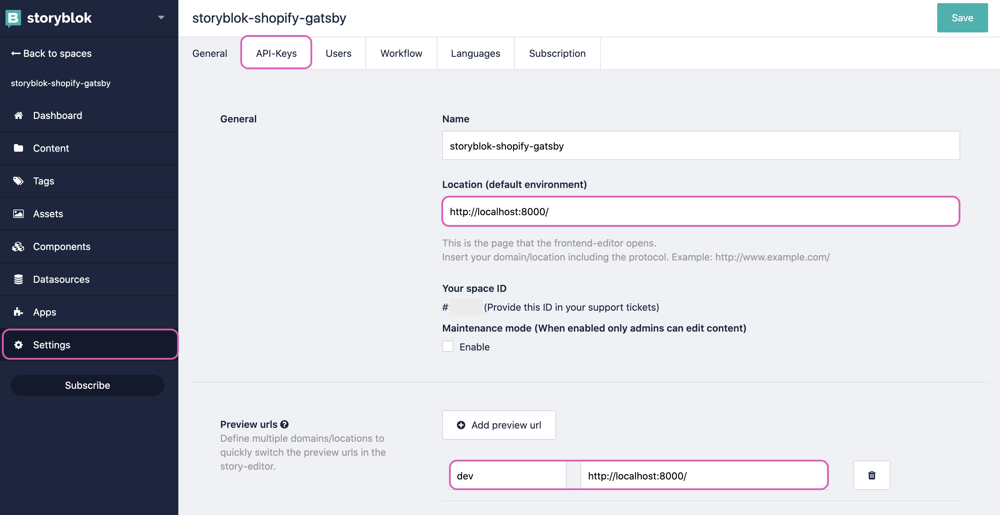
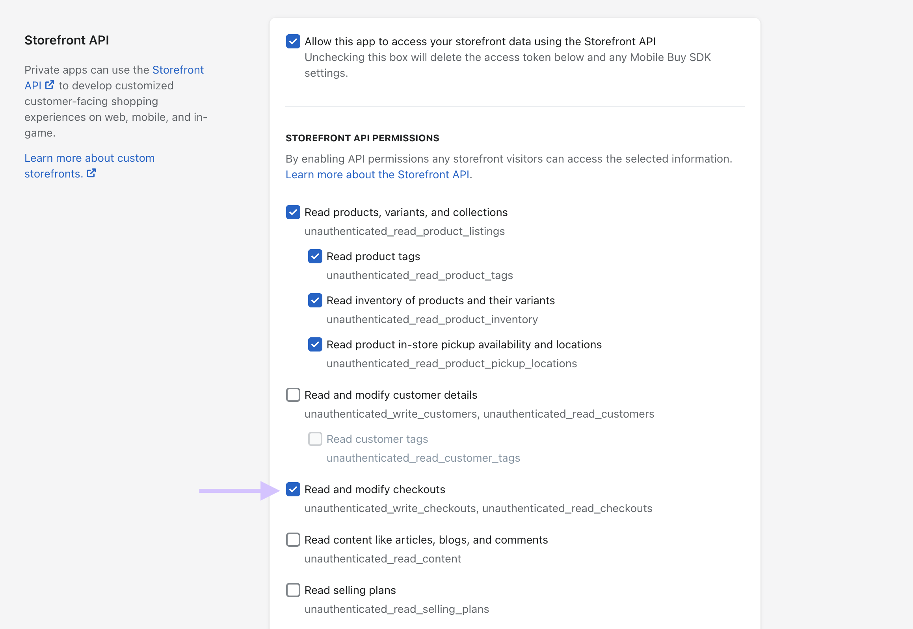

# How to Build a Storefront with Gatsby.js and Shopify (storyblok-shopify-gatsby repo)

This is a hands-on tutorial to build Storyblok with Gatsby & Shopify e-commerce project.

Before reading this tutorial, make sure to complete these steps first in a listed order.

1. [Storyblok: Storefront Setup](https://www.storyblok.com/docs/guide/integrations/ecommerce/storefront-setup)
2. [Storyblok: Shopify](https://www.storyblok.com/docs/guide/integrations/ecommerce/shopify)
3. [Storyblok: eCommerce Field-Type Plugin](https://www.storyblok.com/docs/guide/integrations/ecommerce/integration-plugin)

> 💡 Notes: You'll need to apply for getting access for eCommerce integration in Storyblok. 👉 [https://www.storyblok.com/fs/enterprise-contact](https://www.storyblok.com/fs/enterprise-contact)

# Environment setup

- Install `gatsby-cli`

```
$ npm install -g gatsby-cli
```

- Create e-commerce starter with `gatsby-shopify-starter`

> [Gatsby: gatsby-starter-shopify](https://www.gatsbyjs.com/starters/gatsbyjs/gatsby-starter-shopify)

```
$ gatsby new gatsby-starter-shopify https://github.com/gatsbyjs/gatsby-starter-shopify
$ cd gatsby-starter-shopify
$ gatsby develop
```

5. Check `localhost:8000`. You can see gatsby-shopify-starter is running in the browser.

# Connect Storyblok

- Login to Storyblok
- Install `gatsby-source-storyblok` to link Storyblok and GraphQL
- Install `@storyblok/storyblok-editable` for editor interface
- Install `storyblok-js-client`
```
$ npm install --save gatsby-source-storyblok @storyblok/storyblok-editable storyblok-js-client
```

- Settings -> General Tab -> Fill **"Location (default environment)"** as **"http://localhost:8000/"**
- Settings -> General Tab -> Fill **"Preview urls"** as **"dev"** and **"http://localhost:8000"**
- Settings -> API-Keys -> Copy the preview token



- Paste the preview token into `.env.development` & `.env.production`

 `.env.development` & `.env.production`

```
GATSBY_STOREFRONT_ACCESS_TOKEN=YOUR_STORE_ACCESS_TOKEN
GATSBY_SHOPIFY_STORE_URL=your-shop.myshopify.com
SHOPIFY_ADMIN_PASSWORD=YOUR_SHOPIFY_ADMIN_PASSWORD
```

You can find the domain name of your Shopify shop name & storefront API from this step we completed.

> [Storyblok: Shopify](https://www.storyblok.com/docs/guide/integrations/ecommerce/shopify)

> Admin password can be found in `Apps → manage private apps → Admin API → Password`

- Configure the preview token from `.env.development` & `.env.production` files into `gatsby-config.js` file

 `gatsby-congif.js`

```javascript
module.exports = {
  siteMetadata: {
    title: 'Gatsby Default Starter',
  },
  plugins: [
    {
      resolve: "gatsby-source-shopify",
      options: {
        password: process.env.SHOPIFY_ADMIN_PASSWORD,
        storeUrl: process.env.GATSBY_SHOPIFY_STORE_URL,
        shopifyConnections: ["collections"],
      },
    },
    {
      resolve: 'gatsby-source-storyblok',
      options: {
        accessToken: process.env.STORYBLOK_TOKEN,
        homeSlug: 'home',
        version: process.env.NODE_ENV === 'production' ? 'published' : 'draft'
      }
    },
    ...
  ]
}
```

For more environment variables, you can check Gatsby's documentation.

> [Gatsby: Environment Variables](https://www.gatsbyjs.com/docs/how-to/local-development/environment-variables/)

- Start the server to check everything works

```
$ gatsby develop
```

> Managing cart within Gatsby requires to check the box next to `Allow this app to access your storefront data using the Storefront API` and make sure to check `Read and modify checkouts`. It throws an error of "Error in function eval in ./node_modules/shopify-buy/index.js" (Source: [gatsby-source-shopify](https://github.com/gatsbyjs/gatsby/tree/master/packages/gatsby-source-shopify#enabling-cart-and-checkout-features))



# Enable real-time Visual Editor

- Add `storyblokEntry` query in `src/pages/index.jsx`
- Parse `storyblokEntry` query in `src/pages/index.jsx`
- Import `@storyblok/storyblok-editable` and call
- Delete Hero component from Gatsby
- Test fetching quey (i.e. something easy to fetch without mapping)
- Import DynamicComponent and call in JSX scope

```javascript
import * as React from "react"
import { graphql } from "gatsby"
import { Layout } from "../components/layout"
import { ProductListing } from "../components/product-listing"
import { sbEditable } from "@storyblok/storyblok-editable"
import DynamicComponent from "../components/dynamicComponent"
// import {
//   container,
//   intro,
//   callOut,
//   callToAction,
//   deployButton,
// } from "./index.module.css"

export const query = graphql`
  query {
    shopifyCollection(handle: { eq: "frontpage" }) {
      products {
        ...ProductCard
      }
    }
    storyblokEntry(full_slug: { eq: "home" }) {
      content
    }
  }
`
// function Hero (props) {
//   return (
//     <div className={container}>
//       <h1 className={intro}>Welcome to the GatsbyJS + Shopify Demo Store.</h1>
//       {/* {!!process.env.GATSBY_DEMO_STORE && (
//         <>
//           <p className={callOut}>
//             It's a proof-of-concept in a box, with 10k products and 30k variants
//             to help you get to proof-of-concept as soon as right now.
//           </p>
//           <p className={callToAction}>
//             Hook it up to your own Shopify store data and start customizing in
//             minutes by deploying it to Gatsby Cloud for free. Grab your Shopify
//             store credentials and
//             <a href="https://www.gatsbyjs.com/dashboard/deploynow?url=https://github.com/gatsbyjs/gatsby-starter-shopify&utm_campaign=shopify-starter">
//               
//             </a>
//           </p>
//         </>
//       )} */}
//     </div>
//   )
// }

export default function IndexPage({ data }) {
  let story = data.storyblokEntry
  story.content = JSON.parse(story.content)
  // console.log(story.content)

  const components = story.content.body.map(blok => {
    return (<DynamicComponent blok={blok} key={blok._uid} />)
  })
  // console.log(components)

  return (
    <Layout>
      <div {...sbEditable(story.content)}>
        <h1>{ story.content._uid }</h1>
        { components }
        {/* <Hero /> */}
        <ProductListing products={data?.shopifyCollection?.products} />
      </div>
    </Layout>
  )
}

```

- Create DynamicComponent file in `src/components/dynamicComponent.jsx`
- Import Hero component
- Conditional statement to display blocks or error message
- Import `@storyblok/storyblok-editable` and call

```javascript
import React from "react"
import { sbEditable } from "@storyblok/storyblok-editable"
import Hero from './hero'

const Components = {
  'hero': Hero,
}

const DynamicComponent = ({ blok }) => {
  if (typeof Components[blok.component] !== 'undefined') {
    const Component = Components[blok.component]
    return (<div {...sbEditable(blok)}><Component blok={blok} /></div>)
  }
  return (<p>The component <strong>{blok.component}</strong> has not been created yet.</p>)
}

export default DynamicComponent
```

- Create Hero component file in `src/component/hero.jsx`
- Pass over the queries

```javascript
import * as React from 'react'
import { intro } from "../pages/index.module.css"

const Hero = ({ blok }) => (
  <div>
    <h1 className={intro}>{ blok.headline }</h1>
  </div>
)

export default Hero
```

- Create Hooks component file

# Notes

- Start from "eCommerce Field-Type Plugin"
- After that, starting from "eCommerce Integration" in ["How to Build a Storefront with Next.js and BigCommerce"](https://www.storyblok.com/tp/storefront-next-bigcommerce)