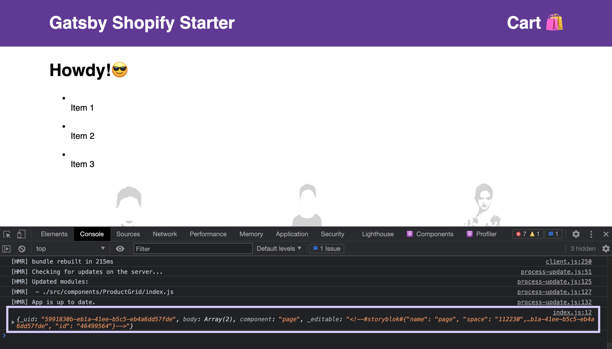
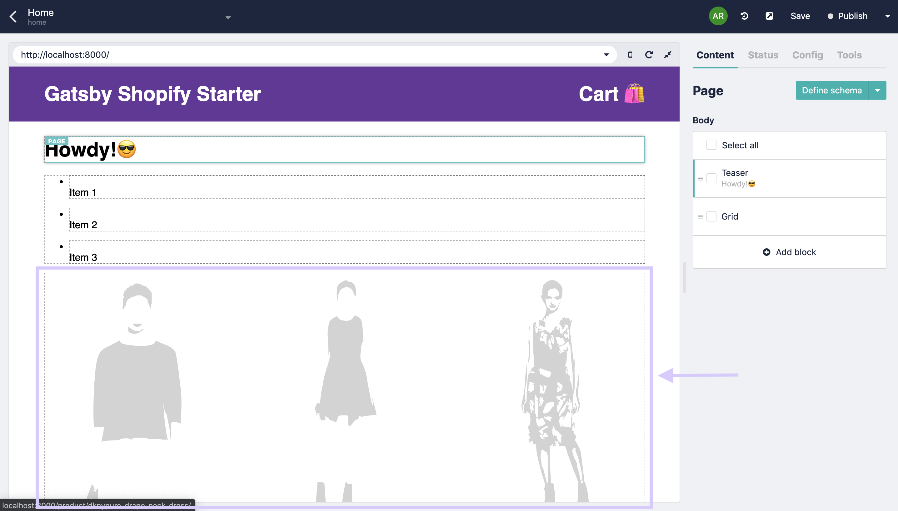

# Storyblok: Gatsby & Shopify e-commerce

This is a hands-on tutorial to build Storyblok with Gatsby & Shopify e-commerce project.

# Environment setup (follow the multilingual blog post except starter)

- Install `gatsby-cli`

```
$ npm install -g gatsby-cli
```

- Create e-commerce starter with `gatsby-shopify-starter`

```
$ gatsby new gatsby-shopify-starter https://github.com/AlexanderProd/gatsby-shopify-starter
$ cd gatsby-shopify-starter
$ gatsby develop
```

5. Check `localhost:8000`. You can see gatsby-shopify-starter is running in the browser.

# Connect Storyblok (follow the multilingual blog post)

- Sign in to Storyblok
- Click "Create new space"
- Select "Create a new space"
- Install `gatsby-source-plugin` to link Storyblok and GraphQL & Install `storyblok-react` for editor interface

```
$ npm install --save gatsby-source-storyblok storyblok-react
```

- Settings -> General Tab -> Fill **"Location (default environment)"** as **"http://localhost:8000/"**
- Settings -> General Tab -> Fill **"Preview urls"** as **"dev"** and **"http://localhost:8000"**
- Settings -> API-Keys -> Copy the preview token & paste into `gatsby-config.js` file

 `gatsby-congif.js`

```
module.exports = {
  siteMetadata: {
    title: 'Gatsby Default Starter',
  },
  plugins: [
    {
      resolve: 'gatsby-source-storyblok',
      options: {
        accessToken: 'YOUR_PREVIEW_TOKEN',
        homeSlug: 'home',
        version: process.env.NODE_ENV === 'production' ? 'published' : 'draft'
      }
    },
    ...
  ]
}
```

- Start the servert to check everything works

```
$ gatsby develop
```

# Creating Components (follow the multilingual blog post except Page component)

- Create DynamicComponent, Page, Teaser, Feature, Grid, and Placeholder components

 `components/DynamicComponent/index.js`

```javascript
import React from 'react'
import Teaser from './Teaser'
import Feature from './Feature'
import Grid from './Grid'
import Placeholder from './Placeholder'

const Components = {
  'teaser': Teaser,
  'feature': Feature,
  'grid': Grid
}

const Component = ({blok}) => {
  if (typeof Components[blok.component] !== 'undefined') {
    const Component = Components[blok.component]
    return <Component blok={blok} />
  }
  return blok.component ? <Placeholder componentName={blok.component}/> : null
}

export default Component
```

 `components/Page/index.js`

```javascript
import React from "react"
import DynamicComponent from "../DynamicComponent"
import SbEditable from 'storyblok-react'

const Page = ({ blok }) => {
  const content =
    blok.body &&
    blok.body.map(childBlok => <DynamicComponent blok={childBlok} key={childBlok._uid}/>)
  return (
    <SbEditable content={blok}>
      { content }
    </SbEditable>
  )
}

export default Page
```

 `components/Teaser/index.js`

```javascript
import React from 'react'
import SbEditable from 'storyblok-react'

const Teaser = ({blok}) => {
  return (
    <SbEditable content={blok}>
      <div>
        <h1>{blok.headline}</h1>
      </div>
    </SbEditable>
  )
}

export default Teaser
```

 `components/Grid/index.js`

```javascript
import React from 'react'
import DynamicComponent from '../DynamicComponent'
import SbEditable from 'storyblok-react'

const Grid = ({ blok }) => (
  <SbEditable content={blok} key={blok._uid}>
    <ul>
      {blok.columns.map((blok) => (
        <li key={blok._uid}>
          <DynamicComponent blok={blok} />
        </li>
      )
      )}
    </ul>
  </SbEditable>
)

export default Grid
```

 `components/Feature/index.js`

```javascript
import React from 'react'
import SbEditable from 'storyblok-react'

const Feature = ({ blok }) => {
  return (
    <SbEditable content={blok} key={blok._uid}>
      <div>
        
        <div>
          <div>{blok.name}</div>
          <p>
            {blok.description}
          </p>
        </div>
      </div>
    </SbEditable>
  )
}

export default Feature
```

 `components/Placeholder/index.js`

```javascript
import React from "react"

const Placeholder = ({componentName}) => (
  <div>
    <p>The component <strong>{componentName}</strong> has not been created yet.</p>
  </div>
);

export default Placeholder;
```

The steps below are the same in multilingual blog post.

# Loading the components in Gatsby

# Setting up the Storyblok Editor

# Changing the real path field

# Connecting the Storyblok Bridge

From here, we'll create more components looks like shop ovewview.

# Create ProductGrid component

- Open `components/DynamicComponent/index.js`
- Add ProductGrid component

 `components/DynamicComponent/index.js`

```javascript
import React from 'react'
import Teaser from '../Teaser'
import Feature from '../Feature'
import Grid from '../Grid'
import Placeholder from '../Placeholder'
import ProductGrid from '../ProductGrid'

const Components = {
  'teaser': Teaser,
  'feature': Feature,
  'grid': Grid,
  // Add ProductGrid component
  'productGrid': ProductGrid
}

const Component = ({ blok }) => {
  if (typeof Components[blok.component] !== 'undefined') {
    const Component = Components[blok.component]
    return <Component blok={blok} />
  }
  return blok.component ? <Placeholder componentName={blok.component} /> : null
}

export default Component
```

- Open `components/ProductGrid/index.js`
- Import `SbEditable`, pass `blok` props, & wrap render values with `SbEditable` component wrapper

 `components/ProductGrid/index.js`

```javascript
import React, { useContext } from 'react'
import { useStaticQuery, graphql, Link } from 'gatsby'

import StoreContext from '~/context/StoreContext'
import { Grid, Product, Title, PriceTag } from './styles'
import { Img } from '~/utils/styles'

// import SbEditable
import SbEditable from 'storyblok-react'

// pass blok props
const ProductGrid = ({ blok }) => {
  // logging out what blok props display
  console.log(blok);
  const {
    store: { checkout },
  } = useContext(StoreContext)
  const { allShopifyProduct } = useStaticQuery(
    graphql`
      query {
        allShopifyProduct(sort: { fields: [createdAt], order: DESC }) {
          edges {
            node {
              id
              title
              handle
              createdAt
              images {
                id
                originalSrc
                localFile {
                  childImageSharp {
                    fluid(maxWidth: 910) {
                      ...GatsbyImageSharpFluid_withWebp_tracedSVG
                    }
                  }
                }
              }
              variants {
                price
              }
            }
          }
        }
      }
    `
  )

  const getPrice = price =>
    Intl.NumberFormat(undefined, {
      currency: checkout.currencyCode ? checkout.currencyCode : 'EUR',
      minimumFractionDigits: 2,
      style: 'currency',
    }).format(parseFloat(price ? price : 0))

// wrap JSX with SbEditable component
  return (
    <SbEditable content={blok}>
      <Grid>
        {allShopifyProduct.edges ? (
          allShopifyProduct.edges.map(
            ({
              node: {
                id,
                handle,
                title,
                images: [firstImage],
                variants: [firstVariant],
              },
            }) => (
              <Product key={id}>
                <Link to={`/product/${handle}/`}>
                  {firstImage && firstImage.localFile && (
                    
                  )}
                </Link>
                <Title>{title}</Title>
                <PriceTag>{getPrice(firstVariant.price)}</PriceTag>
              </Product>
            )
          )
        ) : (
          <p>No Products found!</p>
        )}
      </Grid>
    </SbEditable>
  )
}

export default ProductGrid

```

- Import ProductGrid component into `pages/index.js` page.

 `pages/index.js`

```javascript
import React from 'react'
import Page from '../components/Page'
import { graphql } from 'gatsby'
import StoryblokService from '../utils/storyblok-service'

// import SEO from '~/components/seo'
// import ProductGrid component
import ProductGrid from '~/components/ProductGrid'

export const query = graphql`
  {
    story: storyblokEntry(full_slug: { eq: "home" }) {
      name
      content
      full_slug
      uuid
    }
  }
`

class IndexPage extends React.Component {
  state = {
    story: {
      content: this.props.data.story ? JSON.parse(this.props.data.story.content) : {}
    }
  }

  async getInitialStory() {
    StoryblokService.setQuery(this.props.location.search)
    let { data: { story } } = await StoryblokService.get(`cdn/stories/${this.props.data.story.full_slug}`)
    return story
  }

  async componentDidMount() {
    let story = await this.getInitialStory()
    if (story.content) this.setState({ story })
    setTimeout(() => StoryblokService.initEditor(this), 200)
  }

  render() {
    // return ProductGrid component
    return (
      <>
        <Page blok={this.state.story.content} />
        <ProductGrid blok={this.state.story.content} />
      </>
    )
  }
}

export default IndexPage
```

When you see the browser, you can see objects which is returned from ProductGrid's `blok` props in the dev tools.



Also, ProductGird component appeared.



But we still can't edit from visual editor for a moment.


# Editing Notes

Realized actually need to setup those first in an order below.

1. [Storefront Setup](https://www.storyblok.com/docs/guide/integrations/ecommerce/storefront-setup)
2. [eCommerce Field-Type Plugin](https://www.storyblok.com/docs/guide/integrations/ecommerce/integration-plugin)
3. [How to Build a Storefront with Next.js and BigCommerce](https://www.storyblok.com/tp/storefront-next-bigcommerce) -> Need to write this part with Gatsby ver
4. [Shopify](https://www.storyblok.com/docs/guide/integrations/ecommerce/shopify)

Delete Teaser and Grid components.